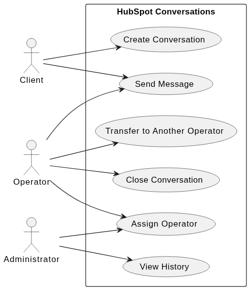
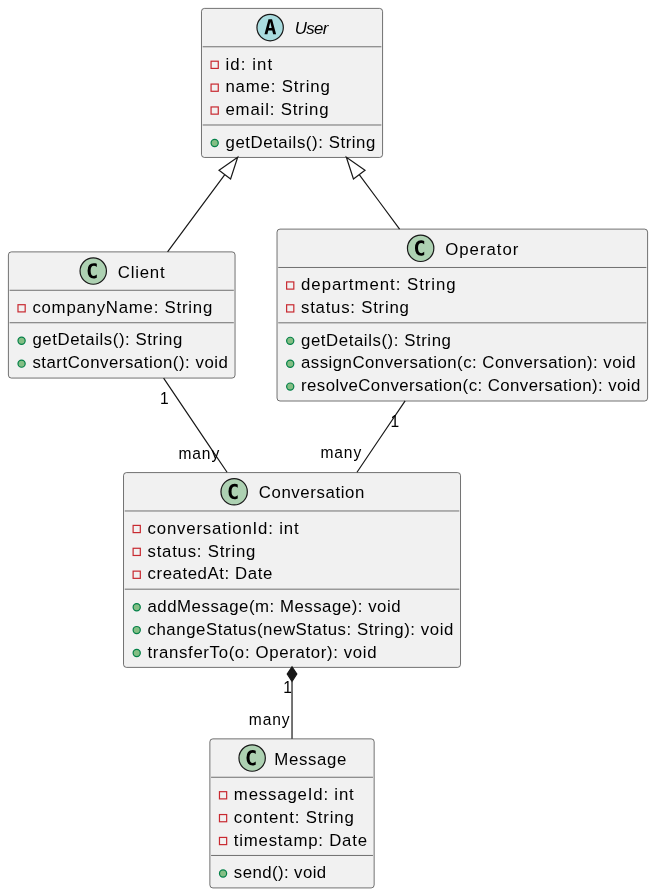
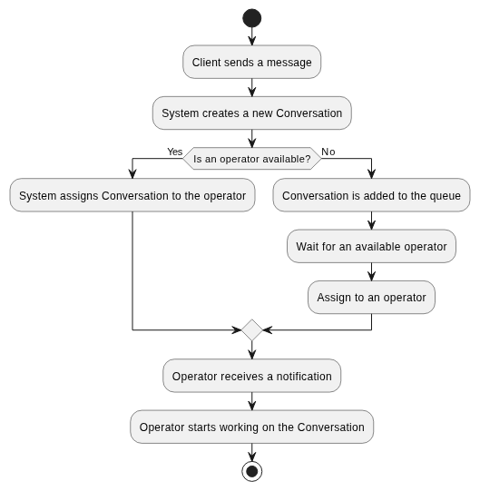
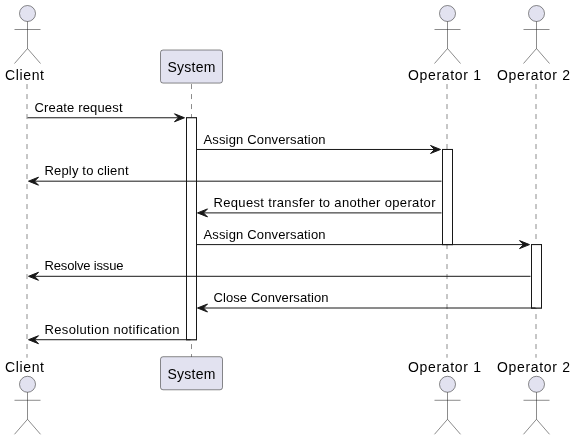

# Laboratory Work 1 – UML Modeling

This repository contains UML diagrams created for **Laboratory Work #1** as part of the **Software Documentation** course. The project focuses on modeling the **HubSpot Service Hub (Conversations)** module.

---

## Project Overview
The goal of this work is to document the functional and structural aspects of a customer service communication system. The diagrams represent the interaction between clients and support operators, the data structure of those entities, and the logic of handling support requests.

---

## Included Diagrams

### 1. Use Case Diagram
* **Description:** Defines the main actors (Client, Operator, Admin) and their interactions with the Conversations module.
* **Key Features:** Message creation, operator assignment, and conversation management.

### 2. Class Diagram
* **Description:** Represents the static structure of the system using **OOP principles** like inheritance and encapsulation.
* **Key Features:** User base class, private attributes, and relationships between Conversations and Messages.

### 3. Activity Diagram
* **Description:** Outlines the workflow logic for initiating a new conversation and assigning it to an available operator.
* **Key Features:** Conditional logic for checking operator availability and queuing mechanisms.

### 4. Sequence Diagram
* **Description:** Displays the chronological interaction between the Client, System, and Operators during a ticket lifecycle.
* **Key Features:** Demonstrates the process of assigning, transferring, and resolving a conversation.

---